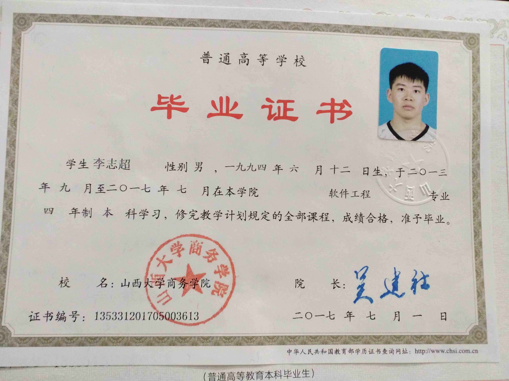
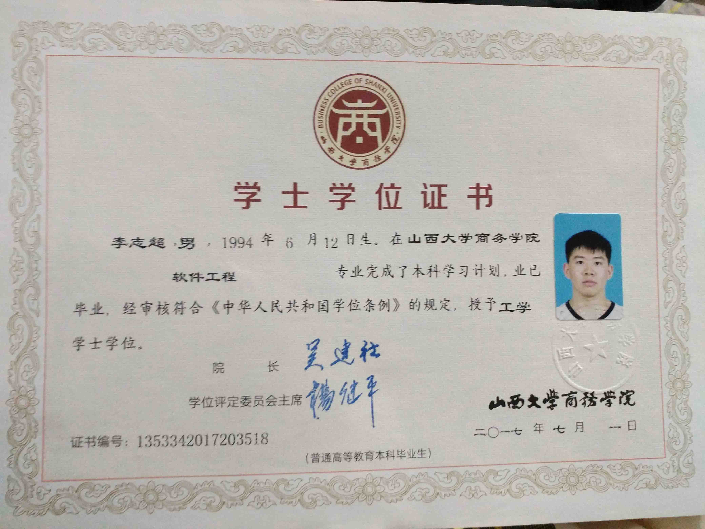

# resume
* **[个人信息](#个人信息)**
* **[教育背景](#教育背景)**
* **[技能描述](#技能描述)**
* **[工作经历](#工作经历)**
* **[项目经验](#项目经验)**
* **[项目总结](#项目总结)**

#### [个人信息](#resume)

> **李志超**
**1994.06.12**
**籍贯：山西**
**岗位：web前端开发**
**工作经验：3年**
**346825961@qq.com**
**18435111384**

#### [教育背景](#resume)

> 山西大学商务学院（本科）  软件工程专业 2013.09-2017.06

#### [技能描述](#resume)

> 移动端：小程序+VantWeapp
pc端：vue+vuex+vue-router+axios+elementUi/iView/Ant-d
开发工具：vsCode
代码管理：git/npm

#### [工作经历](#resume)

* 北京松林和创广告有限公司（2016.07-2017.05)
> html5/css3/javascript/jquery网站开发

* 宁波美杜莎企业孵化器管理有限公司（2017.07-2019.03)
> 微信小程序
> vue后台管理系统

* 闪银奇异科技有限公司 （2019.03-2019.05)
> vue h5app/后台管理

* [浙江中之杰智能系统有限公司](http://www.chinajey.com/) （2019.06-)
腾云互联(浙江)科技有限公司 http://www.tengnat.com/
> vue 企业管理系统开发
#### [项目经验](#resume)
#### [项目总结](#resume)
